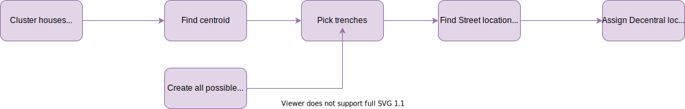
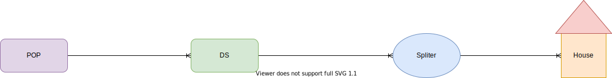

This application attempts to find a local minimum Fiber network plan for residential areas. 
The application has two sub-models, the first of which uses OpenStreetMaps data and parameter provided by the operator to optimize the Fiber-to-the-Home underground cables routes for cost savings.
The model is designed consider factors such as:
- Which side of the road would cost less to dig-up
- The extra cost of digging across the road
- Obstacles such as bridges, rivers, monuments
- Cost of fiber per KM
- Cost of trench per KM
- Cost of trench to cross the road
- Cost of equipment
- Limits of PON/GPON networks
- Cost of hardware (Street cabinets and new powered decentralize locations)

The second model would be based on the operators existing churn, acquisition and up-sell models that would predict the up take in revenue if a town/burrow would be supplied with fiber internet based on previous areas that have rolled out, or on estimates.

Using these two models the operator could rank all future fiber roll out areas based on ROI and roll out the areas with eh highest ROI first.
And the network planners could use the route planner maps as a starting point for the actual route plan since it can be displayed as  a custom layer in OpenStreetMaps.





Relationship Diagram

# Install
```bash
conda config --prepend channels conda-forge
conda create -n ftth_planner --strict-channel-priority osmnx
```
