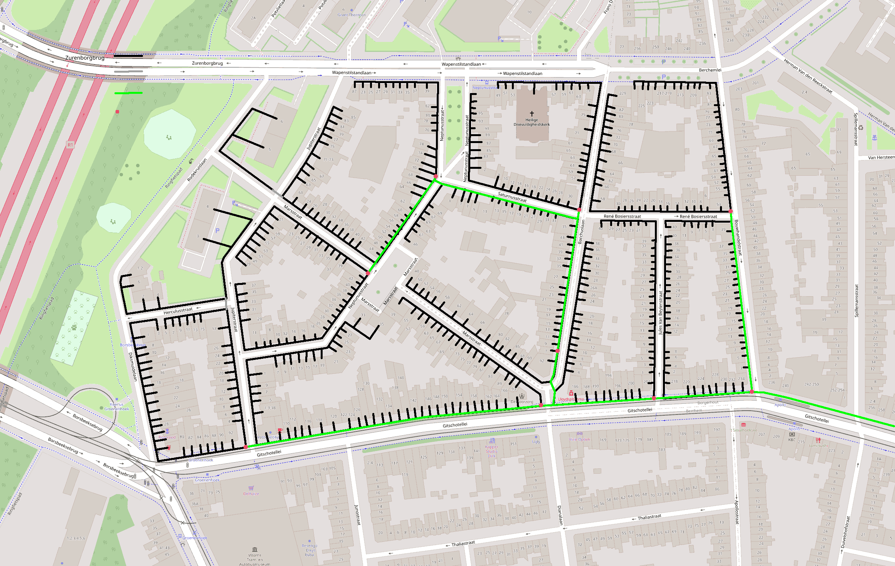
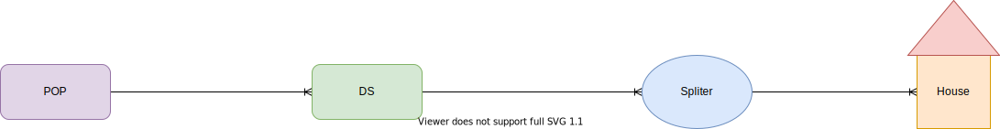

# Fiber to the Home Planner
This Proof of Concept application that attempts finding a "optimal" fiber network planning for a map area.

The application uses OpenStreetMaps data and parameter provided by the operator to optimize the Fiber-to-the-Home underground cables routes for cost savings.

The model is designed consider factors such as:
- Which side of the road would cost less to dig-up
- The extra cost of digging across the road
- Obstacles such as bridges, rivers, monuments
- Cost of fiber per KM
- Cost of trench per KM
- Cost of trench to cross the road
- Cost of equipment
- Limits of PON/GPON networks
- Cost of hardware (Street cabinets and new powered decentralize locations)

The model should output a detailed planning along with itemized material and labour estimates.


Relationship Diagram

## Install
```bash
conda config --prepend channels conda-forge
conda create -n ftth_planner --strict-channel-priority osmnx
```

## Running web app
```bash
streamlit run ftth_app.py
```

## Know bugs
If you have a idea on how to fix any bug, please send me a pull request.

- OpenStreetmap data often doesn't contain building address data, so 
  it il not work in areas that have less than 96 addresses registered
  
- If building don't have address information we would of course look for the closest trench, 
  but this would be computationally expensive to do for all buildings and all trenches
  
- Buildings with address information sometimes do not find the closest trench, not sure why
